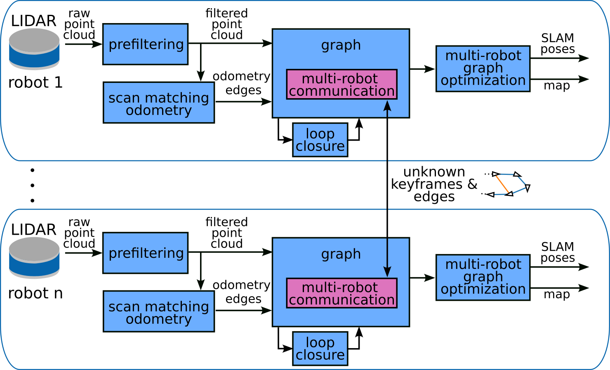

# Multi-Robot Graph SLAM using LIDAR

This repository contains a ROS2 multi-robot 3D LIDAR SLAM implementation based on the [hdl_graph_slam](https://github.com/koide3/hdl_graph_slam) package. The package is tested on ROS2 humble and it is under active development.

The repositories that will be cloned with the vcs tool are:

- [mrg_slam](https://github.com/aserbremen/mrg_slam) - Multi-Robot Graph SLAM using LIDAR based on hdl_graph_slam
- [mrg_slam_msgs](https://github.com/aserbremen/mrg_slam_msgs) - ROS2 message interfaces for mrg_slam
- [mrg_slam_sim](https://github.com/aserbremen/mrg_slam_sim) - Gazebo simulation for mrg_slam for testing purposes
- [fast_gicp](https://github.com/SMRT-AIST/fast_gicp) - Fast GICP library for scan matching
- [ndt_omp](https://github.com/koide3/ndt_omp) - Normal Distributions Transform (NDT) library for scan matching

The procesing pipeline follows the following diagram:
<!-- display image media/system_overview.png   -->


## Dependencies

- OpenMP
- PCL
- g2o
- suitesparse

The following ROS packages are required:

- geodesy
- nmea_msgs
- pcl_ros

## Installation

```
sudo apt install python3-vcstool
git clone https://github.com/aserbremen/Multi-Robot-Graph-SLAM
cd Multi-Robot-Graph-SLAM
mkdir src
vcs import src < multi_robot_graph_slam.repos
colcon build --symlink-install
source install/setup.bash
```

## Docker Installation

The docker user has the id 1000 (default linux user). If you experience issues seeing the topics from the docker container, you might need to change the user id in the Dockerfile to your user id.

```
cd docker/humble
docker build -t my_user/mrg_slam:0 .
```
You should be able to comminicate with the docker container from the host machine, see Usage section below.

## Usage

Launch the SLAM node with the command below. `model_namespace` is going to be used to namespace all the topics and services of the robot, and `x`, `y`, `z`, `roll`, `pitch`, `yaw` are the initial pose of the robot in the map frame. Check out the launch file [mrg_slam.launch.py](https://github.com/aserbremen/mrg_slam/blob/main/launch/mrg_slam.launch.py) and the config file [mrg_slam.yaml]([config/mrg_slam.yaml](https://github.com/aserbremen/mrg_slam/blob/main/config/mrg_slam.yaml)) for more parameters. The main point cloud topic necessary is `model_namespace/velodyne_points`. Per Default the model namespace is `atlas` and `use_sim_time` is set to `true`:

```
ros2 launch mrg_slam mrg_slam.launch.py model_namespace:=atlas x:=0.0 y:=0.0 z:=0.0 roll:=0.0 pitch:=0.0 yaw:=0.0
```

If you want to run the SLAM node inside a docker container, make sure that the docker container can communicate with the host machine. For example, environment variables like ROS_LOCALHOST_ONLY or ROS_DOMAIN_ID should be correctly set. Then run the following command:

```
docker run -it --rm --network=host --ipc=host --pid=host -e MODEL_NAMESPACE=my_robot_name -e X=0.0 -e Y=0.0 -e Z=0.0 -e ROLL=0.0 -e PITCH=0.0 -e YAW=0.0 -e USE_SIM_TIME=true --name my_robot_name_slam  my_user/mrg_slam:0
```

Visualize the SLAM result with the following command. The rviz configuration is configured for the robot names `atlas` and `bestla`:    

```
rviz2 -d path/to/mrg_slam/rviz/mrg_slam.rviz --ros-args -p use_sime_time:=true # use_sim_time when working with robags or gazebo
```

Check out the repository [mrg_slam_sim](https://github.com/aserbremen/mrg_sim) for testing out the multi-robot SLAM implementation in a simulated environment using Gazebo (tested on Fortress).

More information to come soon.